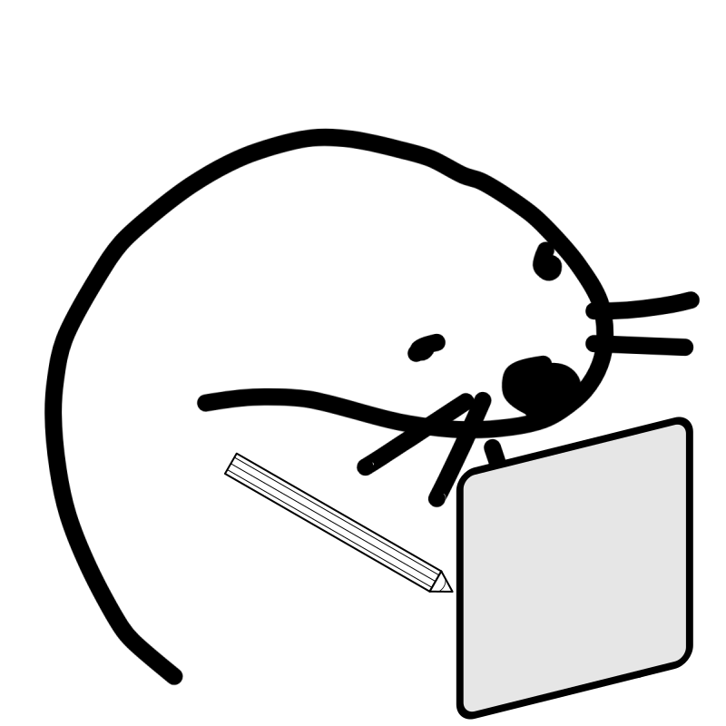

# Notter

Simple note-taking application where you own your data.

Main principles:

- You own your own data - no vendor lock in.
- Serverless architecture - there is no backend, you decide where you want to store your data.
- Simple - just the basics to get things done.

You can test/use it yourself at https://coffei.github.io/notter.

## Where are the data stored?

Currently data are stored locally in your browser. More comprehensive and fool-proof options will be added later.

## Why another note-taking app?

Why not? :-)

I liked the concept of a serverless web app. An app that requires no login, doesn't need a backend
server, runs just on your machine. It's like how desktop apps worked before. So I decided to test
the concept with something simple.

Since persistence is important property of note-taking app I do plan to add something more resilient
than just storing the notes in your browser.

## What's up with that strange name?

I guess I [like otters](https://github.com/Coffei/monitor_otter) or something.

## Development info

First install dependencies with `npm install`

To start the app locally run `npm run dev`.

To build the app for production run `npm run build.`
